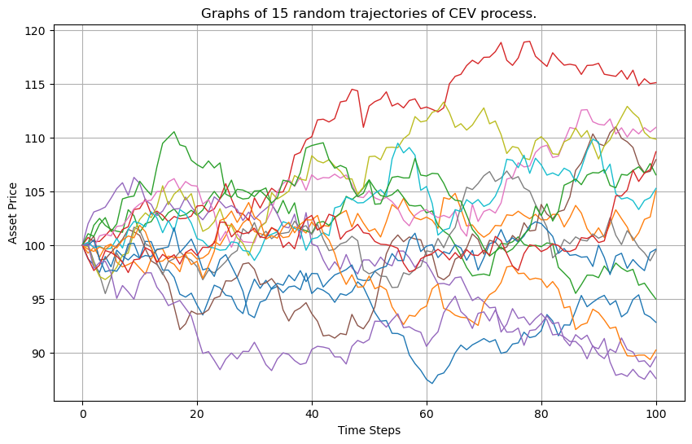

# Monte-Carlo Option Pricing under a CEV Process

Pricing derivatives by **Monte-Carlo simulation** of the underlying asset under the
**Constant Elasticity of Variance (CEV)** model.

## Model

The CEV process generalizes geometric Brownian motion by letting volatility depend on the price
level through an elasticity parameter `gamma`:

$$dS_t = (r - q)\,S_t\,dt + \sigma\,S_t^{\gamma}\,dW_t$$

where `r` is the risk-free rate, `q` the dividend yield, `sigma` the volatility scale, and `gamma`
the elasticity (γ = 1 recovers the Black–Scholes GBM case).

## What's inside

- `simulate_cev(...)` — path simulation of the CEV process (`utils/utils.py`)
- `plot_mc_paths(...)` — visualization of simulated trajectories
- `main.ipynb` — pricing experiments and convergence analysis
- `doc/` — written report (PDF)

Example simulated paths:



## Run

```bash
pip install numpy matplotlib
jupyter notebook main.ipynb
```

---

*Course project in Monte-Carlo methods (Vega Institute).*
